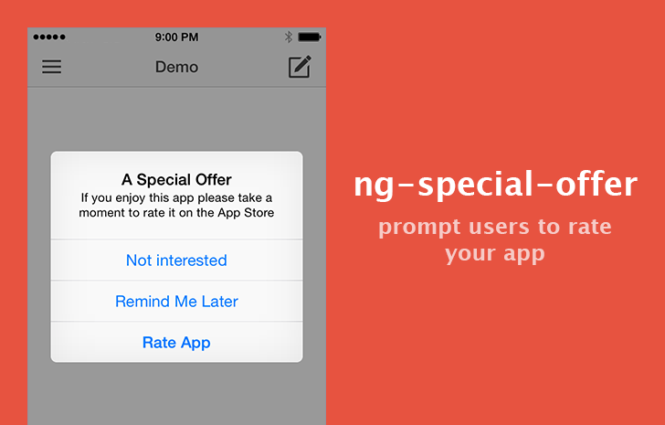

# ng-special-offer



## Features

 * Easy to use with Ionic or any AngularJS cordova app
 * Customizable
 * 100% Javascript

## Install

Install ng-special-offer with bower

    $ bower install ng-special-offer

Add the cordova notification plugin

    $ cordova plugin add https://git-wip-us.apache.org/repos/asf/cordova-plugin-dialogs.git

Include ng-special-offer from the bower library

    <script src="bower_components/ng-special-offer/src/ng-special-offer.js"></script>
    <script src="bower_components/ngstorage/ngStorage.min.js"></script>

## Usage

Include as a dependency in your angular module

```javascript
angular.module('myApp', ['ngSpecialOffer'])
```

Configure when the device is ready:

```javascript
.run(['$ionicPlatform', '$specialOffer', function($ionicPlatform, $specialOffer) {
    $ionicPlatform.ready(function() {

        var appVersion = '1.0.0';
        var iosId = '12345';
        var androidPackageName = 'your.package.name';

        $specialOffer.init({
            id           : 'my-special-offer' + appVersion,
            showOnCount  : 5,
            title        : 'A Special Offer',
            text         : 'If you enjoy this app please take a moment to rate it',
            agreeLabel   : 'Rate App',
            remindLabel  : 'Remind Me Later',
            declineLabel : 'Not interested',
            onAgree      : function () {
                // agree
                if (window.device.platform === 'iOS') {
                    window.open($specialOffer.appStoreUrl(iosId));
                } else if (window.device.platform === 'Android') {
                    window.open($specialOffer.googlePlayUrl(androidPackageName));
                }
            },
            onDecline   : function () {
                // declined
            },
            onRemindMeLater : function () {
                // will be reminded in 5 more uses
            },
        });
    });
}]);

```

## Tutorial

[Prompt User To Rate Ionic Framework Mobile App](https://blog.nraboy.com/2015/02/prompt-user-rate-ionic-framework-mobile-app/) by @nraboy

## License

MIT
